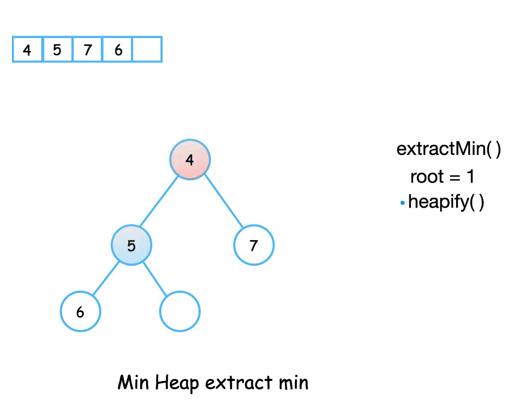

# Binary Heap Class

- Python의 내장 모듈 `heapq`와 동일한 구조의 (min) binary heap 구현


## 삽입


1. 요소를 가장 하위 레벨의 최대한 왼쪽으로 삽입 → 배열로 표현할 경우 가장 마지막에 삽입
2. 부모 값과 비교해 값이 더 작은 경우 위치를 변경 → Up-heap
3. 계속해서 부모 값과 비교해 위치를 변경 → 가장 작은 값일 경우 루트까지 올라감


## 추출



- 루트를 추출하면 됨
- 추출 후 다시 힙(heap)의 특성을 유지하는 작업이 필요하므로 $O(\log n)$의 시간복잡도를 가짐
- 추출 이후에 비어있는 루트에는 가장 마지막 요소가 올라가게 되고, 자식노드 값과 비교해서 자식 보다 크면 내려가는 Down-heap 수행


## Code

```python
class BinaryHeap(object):
    def __init__(self):
        # tree의 배열 표현 경우
        # index를 1로 시작하는 것이 편리함
        self.items = [None]
    
    def __len__(self):
        return len(self.items) - 1
    
    # 삽입 시 실행, 반복 구조 구현
    def _percolate_up(self):
        i = len(self)
        parent = i // 2
        while parent > 0:
            if self.items[i] < self.items[parent]:
                self.itmes[parent], self.items[i] = \
                	self.items[i], self.items[parent]
            i = parent
            parent = i // 2
    
    def insert(self, k):
        self.items.append(k)
        self._percolate_up()
        
    # 추출 시 실행, 재귀 구조 구현
    def _percolate_down(self, idx):
        left = idx * 2
        right = idx * 2 + 1
        smallest = idx
        
        if left <= len(self) and self.items[left] < self.items[smallest]:
            smallest = left
        
        if right <= len(self) and self.items[right] < self.items[smallest]:
            smallest = right
            
        if smallest != idx:
            self.items[idx], self.items[smallest] = \
            	self.items[smallest], self.items[idx]
            self._percolate_down(smallest)
        
    def extract(self):
        extracted = self.items[1]
        self.items[1] = self.items[len(self)]
        self.items.pop()
        self._percolate_down(1)
        return extracted
```

